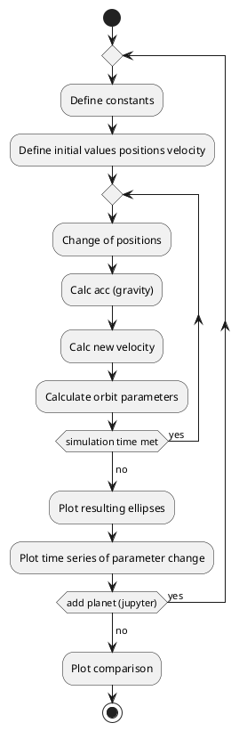

# Goal

## Overview

```plantuml
@startuml

start
repeat
  :Define constants;
  :Define initial values positions velocity;
  repeat
    :Change of positions;
    :Calc acc (gravity);
    :Calc new velocity;
    :Calculate orbit parameters;
  repeat while (simulation time met) is (yes)
  ->no;
  :Plot resulting ellipses;
  :Plot time series of parameter change;
repeat while (add planet (jupyter)) is (yes)
->no;
:Plot comparison;
stop

@enduml
```
